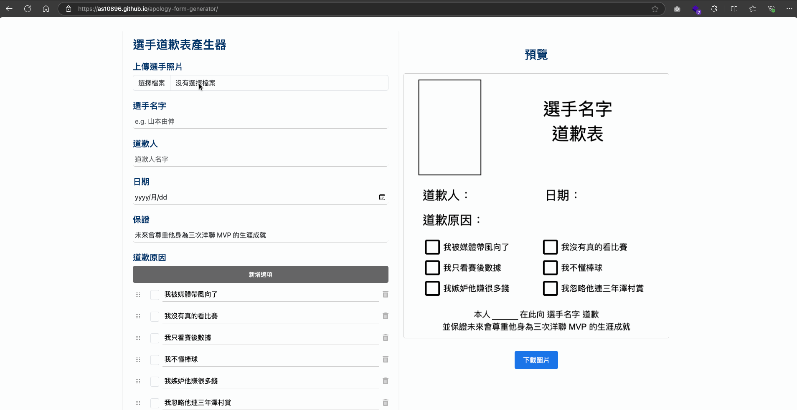

# Apology Form Generator
For the motivation behind this project, please refer to <a href="https://www.ptt.cc/bbs/BaseballXXXX/M.1728961890.A.1CE.html" target="_blank">this post</a>.

## Demo

## Usage
Simply open `index.html` in any modern web browser to use the generator. No local server or build step is required, as all external dependencies are loaded directly via CDN.

## Note
This code was entirely generated by ChatGPT as part of a fun project to test its coding capabilities.  
There are a few canvas layout issues that I didn't address (such as long names overlapping with the date).  
Since I haven't worked in frontend development for a while, fixing these would take more time than I'm willing to spend.  
If you'd like to improve the code, feel free to open a PR!
